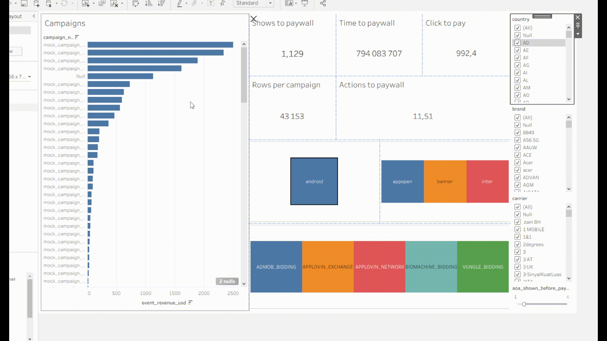
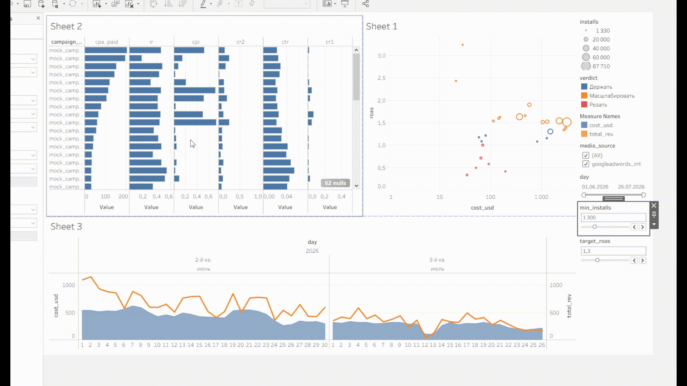
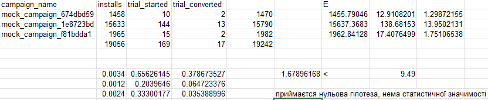

# Вибір найефективніших рекламних кампаній

## План звіту

 - дашборд Tableau з показу реклами
 - дослідження впливу реклами на користувача
 - дашборд Tableau з залучення аудиторії
 - розрахунок LTV/CAC
 - проведення гіпотетичного тестування

## Продаж реклами `ad_revenue_raw`

### Дашборд ефективності рекламних кампаній

### Структура дашборду

1. **Права таблиця відображає основний показник - прибуток, розрахованний для кожної кампанії.** Додатково можна подивитися вартість на один показ.
2. Нижня та права частини дашборду виступають у ролі фільтрів. Вони допомогають провести **аналіз сегментів** в середині конкретної кампанії.
3. Частина зверху надає оцінку чутливості до зусиль **(Effort Sensitivity)**. Тобто скільки зусиль потрібно прикласти для конвертації в преміум користувача

### Додатковий аналіз демонстрації реклами

Виконаємо запит, щоб дослідити негативний вплив на постійну демонстрацію різної реклами (розрахунок коефіцієнту спираючись на відписку)

> **Всі запити та пояснення до них можна переглянути в директорії проекту**
>

Результат виконання

| creative\_id | ad\_format | total\_shows | penalty\_sum | avg\_penalty\_per\_show |
| :--- | :--- | :--- | :--- | :--- |
| 705521442 | banner | 51 | -1 | -0.0196078431372549 |
| 957700067 | appopen | 23 | -0.3333333333333333 | -0.014492753623188404 |
| 400287237 | appopen | 128 | -1.412037037037037 | -0.011031539351851851 |
| 784500898 | appopen | 189 | -2 | -0.010582010582010581 |
| 895991389 | appopen | 298 | -2.5 | -0.008389261744966443 |

Слід зосередити увагу на креативи, адже з ними пов'язанний різкий відток аудиторії

## Залучення аудиторії `cost_table` `non_org_installs_report` `in_app_events_report`

### Дашборд замовленої реклами

### Структура дашборду

1. **Права верхня частина - портфельна карта кампаній (головний лист).** Одна точка = одна кампанія: вісь X - витрачені гроші (логарифмічна шкала, бо спенд розкиданий від десятків до тисяч), вісь Y - **ROAS**, розмір точки — кількість інсталів, колір - **вердикт** (`Держать` / `Масштабировать` / `Резать`). Правий нижній кут - великий спенд при ROAS нижче одиниці, лівий верхній — дешеві кампанії з високою окупністю.
2. **Ліва частина - ціна кожного кроку воронки.** Один рядок = кампанія, окремі панелі: `cpa_paid`, `ir`, `cpi`, `cr2`, `ctr`, `cr1`. Портфельна карта показує **що** не так, ця панель - **чому**: дорогий `cpi` при нормальній конверсії чи нормальний `cpi` при провальному `cr1`/`cr2`.
3. **Нижня частина - пейсинг і окупність по календарю.** Заливка - витрати по днях, лінія - виручка. Місця, де лінія падає під заливку, показують дні, коли закупівля не відбилась.
4. **Права колонка - керування.** `day` фільтрує **по даті установки**, тобто зберігає когортну логіку: беремо гроші, витрачені в періоді, і всю виручку, яку вони принесли. `min_installs` - поріг статистичної значущості, `target_roas` - межа, за якою кампанія переходить з «держать» у «масштабировать», `media_source` - розріз по джерелах.

### Які рішення приймаються

- **Перерозподіл бюджету.** Кампанії з лівого верхнього кута - кандидати на збільшення ставки, з правого нижнього - на зупинку. Розмір точки не дає переплутати ефективність із масштабом: висока окупність на трьох сотнях інсталів це тест, а не результат.
- **Різні дії для однакового симптому.** Дві кампанії з однаковим ROAS можуть бути збитковими з різних причин, і ліва панель розводить їх: переплата за аукціон лікується ставкою, поганий трафік - креативом і таргетингом.
- **Пошук недоосвоєного бюджету.** Дні з нормальною окупністю, але низькими витратами на нижньому графіку - найдешевше джерело зростання.
- **Відсікання шуму.** Повзунок `min_installs` прибирає дрібні кампанії, де середні значення нічого не означають; `target_roas` дозволяє перевірити портфель під різні вимоги до окупності.

> **Дані обрізані на 26.07.2026.** Кампанії з установками в останні тижні фізично не встигли принести виручку з продовжень підписки і на карті провалюються вниз незаслужено - перед висновками правий край фільтра `day` варто відсунути.

### Додатковий аналіз замовленої реклами

Знайдемо **ltv/cac** відношення (аналог _roce_) Для кожної кампанії

Для початку **LTV**

| campaign\_id | campaign\_name | installs | sub\_rev | ad\_rev | total\_rev | ltv |
| :--- | :--- | :--- | :--- | :--- | :--- | :--- |
| 810543724 | mock\_campaign\_c492b014 | 78 | 75.83278671670001 | 33.7548174753 | 109.58760419199997 | 1.40496928451282 |
| 739276167 | mock\_campaign\_1fbdf2e3 | 3708 | 765.3209029999998 | 2597.0678812237966 | 3362.3887842237987 | 0.906793091753991 |
| 232552584 | mock\_campaign\_a5da28b5 | 797 | 277.5440923573 | 383.6410971722001 | 661.1851895295 | 0.829592458631744 |

Аналогічно **CAC**

| campaign | cost\_usd | installs | cpi |
| :--- | :--- | :--- | :--- |
| mock\_campaign\_2c0c0430 | 3126.8997111897806 | 86098 | 0.03631791343805641 |
| mock\_campaign\_a2e93e84 | 2958.8095718483955 | 5730 | 0.5163716530276432 |
| mock\_campaign\_1fbdf2e3 | 2726.081430682651 | 3708 | 0.7351891668507688 |
| mock\_campaign\_fe944d1c | 2212.6867148392066 | 44963 | 0.049211278492075856 |
| mock\_campaign\_6fcee95d | 1499.2572798527267 | 29565 | 0.05071054557255967 |
| mock\_campaign\_c13d8f45 | 1279.240518610913 | 14281 | 0.0895763965136134 |

Так як нема доступу для створення _VIEV_, доведется робити один великий запит для об'єднання обох показників. Натомість маємо :

| campaign | installs | cost\_usd | ltv\_cac |
| :--- | :--- | :--- | :--- |
| mock\_campaign\_674dbd59 | 1458 | 28.447611096999886 | 3.2233275697048027 |
| mock\_campaign\_f81bdda1 | 1965 | 20.94410339910014 | 2.422974729387573 |
| mock\_campaign\_1e8723bd | 15633 | 571.6565016151412 | 1.8408818980601365 |
| mock\_campaign\_b0c8a1e0 | 5068 | 476.7649071591986 | 1.6423943200360849 |
| mock\_campaign\_10287894 | 42954 | 367.3408266068714 | 1.6250998919732702 |

Рекламні кампанії, що мають показник більше 3 (золотий стандарт) приносять стабільний прибуток та кошти на розвиток. Те що нижче 1, не покриває витрати, а залучення стає неприбутковим.

>Виручка є лише за 01.06–26.07.2026, тому в старих когорт зрізано початок життя (тріал і перша конверсія),  а у свіжих - продовження, і це заниження нерівномірне: воно залежить від того, коли кампанія крутилась,а не від її якості, тому коректне порівняння дає лише фіксоване вікно - юзери з install_date у межах
> періоду та їхня виручка за перші 7 днів життя.

Оберемо 3 найкращі кампанії за останньою метрикою. Порівняємо їх між собою, та спробуємо дізнатися, чи є серед них фаворит.

Як бачимо ксі квадрат статистика не перевищує критичне значення, а одже вимушені прийняти нульову гіпотезу. Різниця між групами не є статистично значимою. Окремого фаворита, на якого слід було посилатися - нема.
